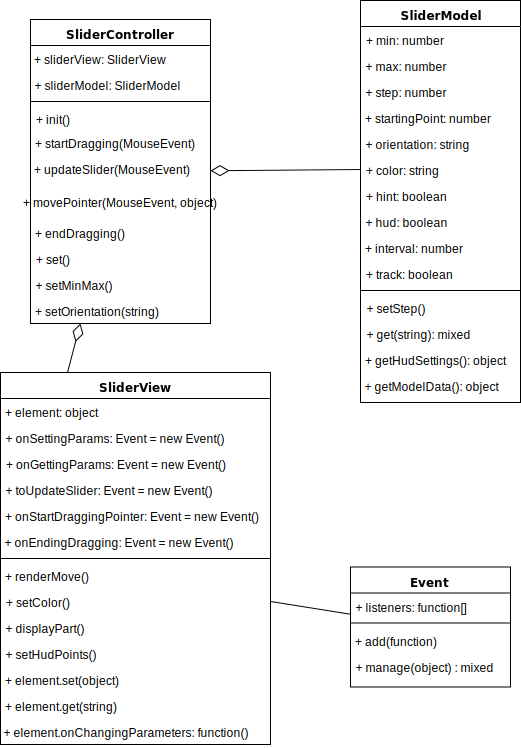

<h2>Документация к плагину</h2>

<a href="https://spekalsg3.github.io/SliderPlugin">spekalsg3.github.io/SliderPlugin</a> - демонстрационная страница

<h4>Как работать с этим плагином?</h4>
<ol>
<li>
Разметка для слайдера должна быть в следующем виде:

    
 <!-- Основной контейнер слайдера -->

        
 <!-- Полоска слайдера -->
            

 <!-- Закрашенная часть -->
        

        
 <!-- Указатель -->
            
 <!-- Подсказка над указателем -->
                

 <!-- Стрелочка подсказки -->
                

 <!-- Блок для значений -->
            

        

        
 <!-- Подпись оси числами -->
        

    

Можно задать свои стили, но должно быть 2 отдельных стиля для вертикальной и горизонтальной ориентации - row и column соотвественно, чтобы изменив стиль на противоположный соотвественно изменился и вид. 
Или же можно использовать готовые стили из файла "SliderPlugin.css" и использовать их надо следующим образом:

    

        

            

        

        

            

                

                

            

        

        

    

</li>
<li>
С подключенным файлом "jQuery.js" и "SliderPlugin.js", выбрать слайдер с помощью jQuery функции $, вызвать у него функцию "AnimateSlider" и передать в нее объект с параметрами, которые надо установить. Вот список возможны параметров и значений: 
{ 
&nbsp;min: *<i>целое число</i>*, 
&nbsp;max: *<i>целое число</i>*, 
&nbsp;step: *<i>целое число больше 0</i>*, 
&nbsp;startingPoint: *<i>целое число</i>*, 
&nbsp;orientation: "row" <i>или</i> "column", 
&nbsp;color: *<i>цвет в HEX коде</i>*, 
&nbsp;hint: true <i>или</i> false, 
&nbsp;hud: true <i>или</i> false, 
&nbsp;interval: *<i>целое число больше 0</i>*, 
&nbsp;track: true <i>или</i> false 
}
</li>
</ol>

<h4>Архитектура</h4>
Архитектура проекта состоит из 3 основных компонентов: Контроллер, Представление и Модель.
<ul>
<li><b>Контроллер</b> SliderController занимается обработкой событий и связывает представление и модель.</li>
<li><b>Представление</b> SliderView взаимодействует с DOM - только через него проходят изменения элементов. Также занимается подключением обработчиков событий, однако обрабатывает их только Контроллер</li>
<li><b>Модель</b> SliderModel обрабатывает и хранит данные о слайдере (шаг, начальное значение, цвет и т.д.).</li>
</ul>

<h4>Событие</h4>
Помимо основных компонентов есть еще класс Событие (Event), который "ловит" действие пользователя и вызывает нужную функцию.

Конструктор этого класса создает массив функций обработчиков.

С помощью метода "add", в массив обработчиков можно добавить нужный обработчик.

С помощью метода "manage", вызываются обработчики.

 

<h4>Представление</h4>
Представление занимается подключением обработчиков и изменение элементов DOM.

Конструктор принимает элемент, с которым этот модуль будет работать, и подключает обработчики с помощью событий. Он также создает пустую функцию у элемента "onChangingParameters", которая будет вызываться при использовании функции "set" у Контроллера.

Задается метод "renderMove" для отображение изменений.

Задаются методы для внешних изменений слайдера: цвет, подпись оси, след за бегунком и подсказка над ним.

 

<h4>Модель</h4>
Модель отвечает за параметры слайдера: позиция, шаг, цвет, ориентация; и промежуточные значения для рассчетов.
Конструктор принимает объект с параметрами слайдера.

Задается метод "setStep" для установления нового значения шага.

Задается метод "getModelData", который возращает данные в виде объекта для вычисления позиции слайдера при взаимодействии с ним.

Задается метод "getHudSettings", который возращает данные в виде объекта для изменения подписи оси.

Задается метод "get" для получения значений из модели.

 

<h4>Контроллер</h4>
Контроллер взаимодействует с представлением и моделью.

Эти модели имеются принимаются как аргументы в конструкторе. Конструктор использвует <a href="https://en.wikipedia.org/wiki/Inversion_of_control#Background">инверсию управления</a> - модули внедряются в него.

Задается метод "init" выставляет начальное положение слайдера, устанавливает его ориентацию и передает в События в Представление функции обработчики.

Задаются обработчики события нажатия на мышь, передвижение мыши, отжатие мыши и отведение мышки от слайдера.

Задается метод "set" для изменения параметров слайдера на принятые значения в виде объекта вида {параметр: значение} и сами функции для установки параметров слайдера (ориентация, цвет и т.д.). Если параметр существует, то выполняется установленный у элемента обраотчик "onChangingParameters", куда передается объект:
{ 
&nbsp;parameter: \*<i>название параметра</i>\*, 
&nbsp;parameterIndex: \*<i>номер параметра по списку</i>\*, 
&nbsp;fromValue: \*<i>значение, которое было установленнно до применеия функции</i>\*, 
&nbsp;toValue: \*<i>значение, которое устанавливают</i>\*, 
}

<h4>Функция подключения плагина к элементу</h4>
Функция AnimateSlider вызывается у элементов jQuery найденных с помощью функции $. AnimateSlider принимает объект с параметрами слайдера:
<ul>
    <li>min (целое натуральное число) - минимальное значение слайдера;</li>
    <li>max (целое натуральное число) - максимальное значение;</li>
    <li>step (целое натуральное число) - размер шага;</li>
    <li>startingPoint (целое натуральное число) - начальное значение слайдера;</li>
    <li>orientation ("column" || "row") - вертикальный или горизонтальный вид слайдер соотвественно;</li>
    <li>color (HEX code) - цвет бегунка, подсказки над ним и следа за бегунокм;</li>
    <li>hint (true || false) - показывать или не показывать подсказку над бегунком соотвественно;</li>
    <li>hud (true || false) - показывать или не показывать подпись оси соотвественно;</li>
    <li>interval (целое натуральное число) - количество чисел для подписи оси;</li>
    <li>track (true || false) - показывать или не показывать след за бегунком соотвественно.</li>
</ul>
Если какое-то значение не установленно то будет установленно значение по умолчанию соотвествующие следующему объекту: 
{ 
&nbsp;min: 0, 
&nbsp;max: 100, 
&nbsp;step: 1, 
&nbsp;startingPoint: this.min, 
&nbsp;orientation: "row", 
&nbsp;color: "#e85f3e", 
&nbsp;hint: true, 
&nbsp;hud: true, 
&nbsp;interval: 5, 
&nbsp;track: true 
}

<h4>Замечания после выполнения работы</h4>
Модули сильно различаются по уровням асбтракции.
Контроллер заботиться обо всех вычислениях, изменениях, обработки событиях.
Модель занимается хранением и предаставлением контроллеру данных.
Представление - подключает обработчики и дает контроллеру доступ к элементу.
Событие - самый маленький класс, только вызывающий функции у нужного обработчика.

<h4>UML-диаграмма</h4>

